# Hotel Reservation System Documentation

## Group Members

- 1: John Adrian D. Bonto - Front End Development, Back End Development, Database Design, UI/UX Designing, Responsive Design, Testing, Deployment, and Documentation.

- 2: Harley Dave L. Andal - re-design (login.html).
- 3: Mark Peneil Basi - Video editor.

## LIVE LINK
This project is finished, tested and deployed at May 31, 2024.

Live link via 000webhost - https://casavista.000webhostapp.com/hotel_reservation_system/index.html
if the website doesn't load, try a different browser.

## File link
 -Github: https://github.com/Adrian9502/casa-vista-hotel-reservation-system
 -Gdrive: https://drive.google.com/drive/folders/1Kpy4Z1BulyEp7R6zXniroRYhBD5Ioolt?usp=drive_link

## Development Tools

-XAMPP: Used for setting up a local server environment.
-VS Code: Used as the primary code editor for development.

## References and acknowledgements

Boxicons: Used for various icons throughout the website.
Google Fonts: Used for custom fonts to enhance the visual appeal of the site.
Font Awesome: Used for additional icons.
Hero Pattern : Used for svg backgrounds.
Unsplash: Used for hotel images.

## NOTE!!
-Change the Database Connection Details: Ensure you update the database connection details in accounts/db.php according to your server configuration.
  $servername = "localhost";
  $username = "root";
  $password = "";
  $dbname = "hotel_reservation_system";

## Project Overview

The "Hotel Reservation System" is a web application designed to manage hotel bookings, allowing users to book rooms, manage reservations, and access hotel information conveniently online. It targets both customers and hotel administrators, enhancing the booking process through a user-friendly interface.

### Frontend Files

- index.html: The landing page.
- login/login.html: Login and registration page.
- pages/customerDashboard.php: Dashboard for customers to manage bookings, provides feedback.
- pages/adminDashboard.php: Admin dashboard for managing the system.

### Libraries and Frameworks

- **HTML/CSS**: Used for the structure and styling of the pages.
- **JavaScript**: Used for dynamic content and form submissions.
- **PHP**: Used for server-side processing and database interaction.
- **MySQL**: Used for database management.

## Video Presentation Link

Please see the attached video presentation demonstrating the features and functionality of the project.

Gdrive:

https://drive.google.com/drive/folders/1wsNiLeH3azpjtBTM7OoD1ZATzFm5Eqgb?fbclid=IwAR1pVJhK00C5hLfE2J355J6xp_mkggraNwH7X60WUwPdQ2O7obaqJ3iZrFc

# Page Overview

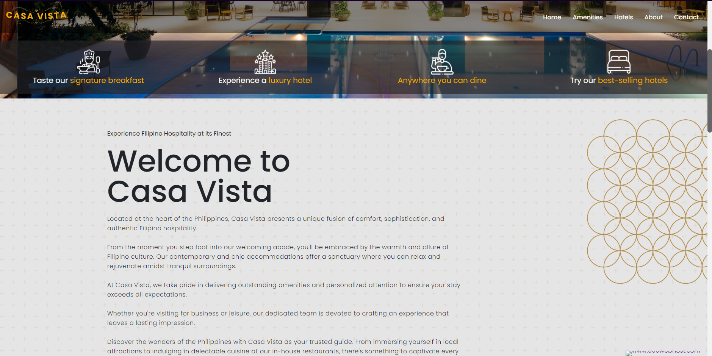
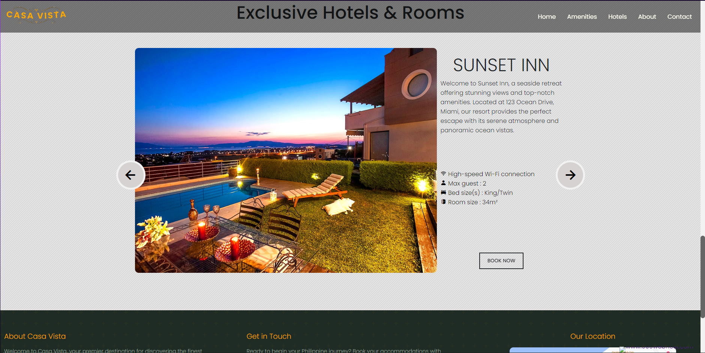
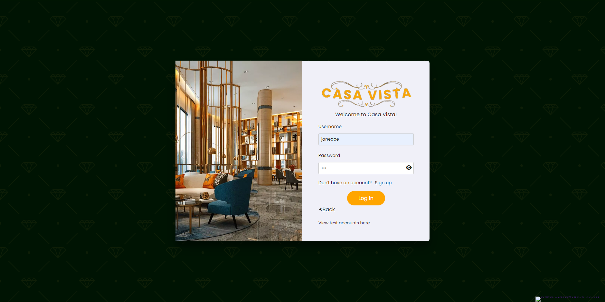
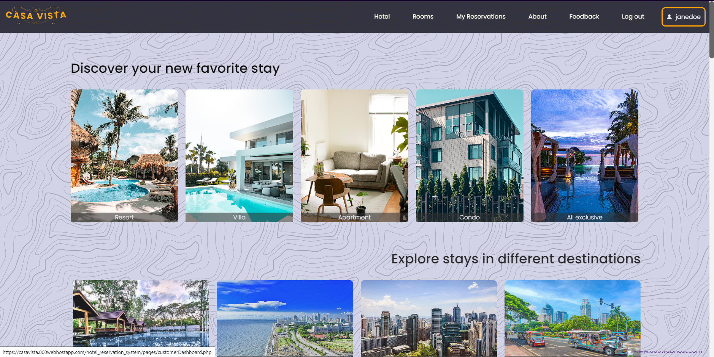
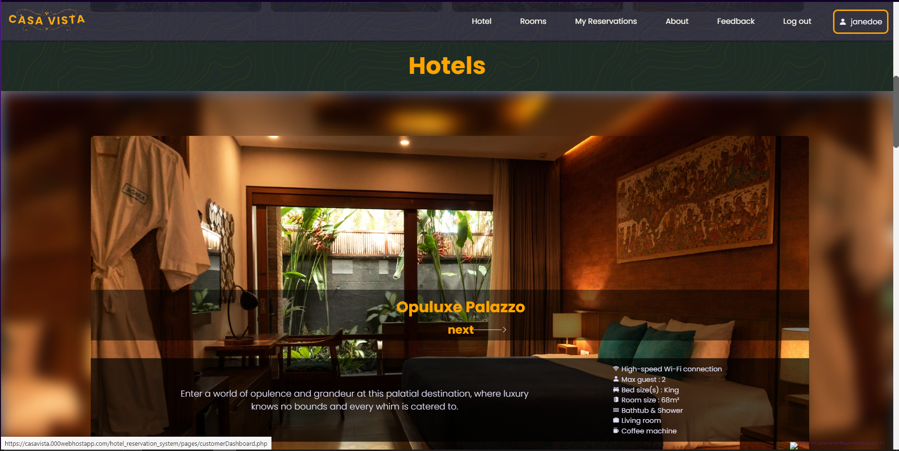
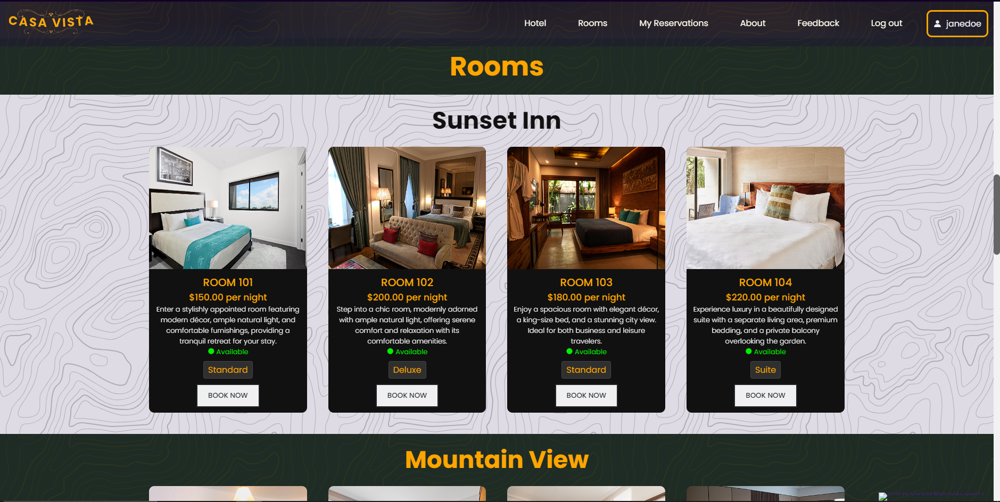
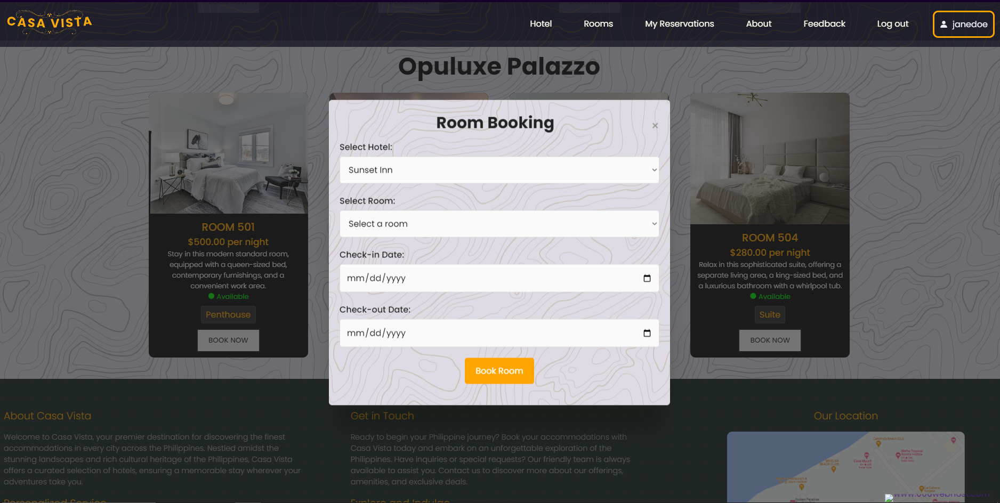
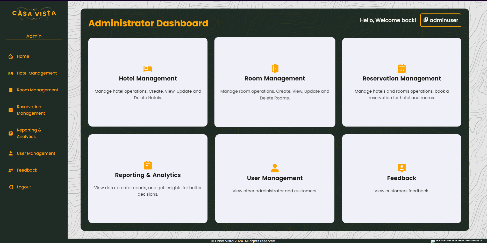
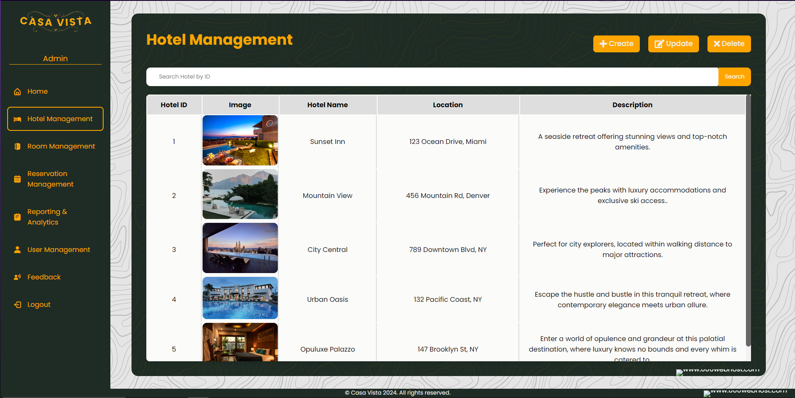
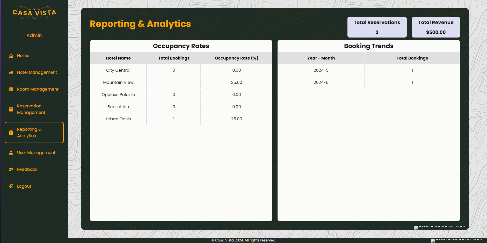
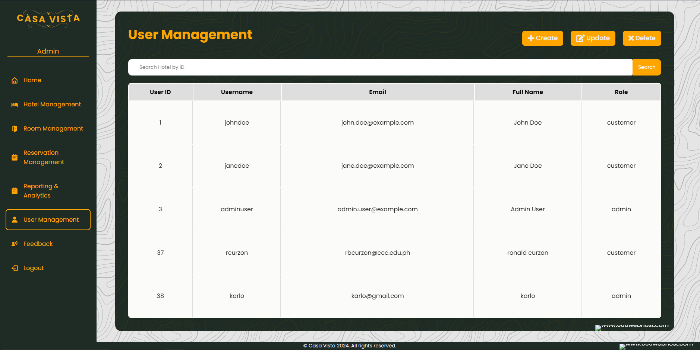

